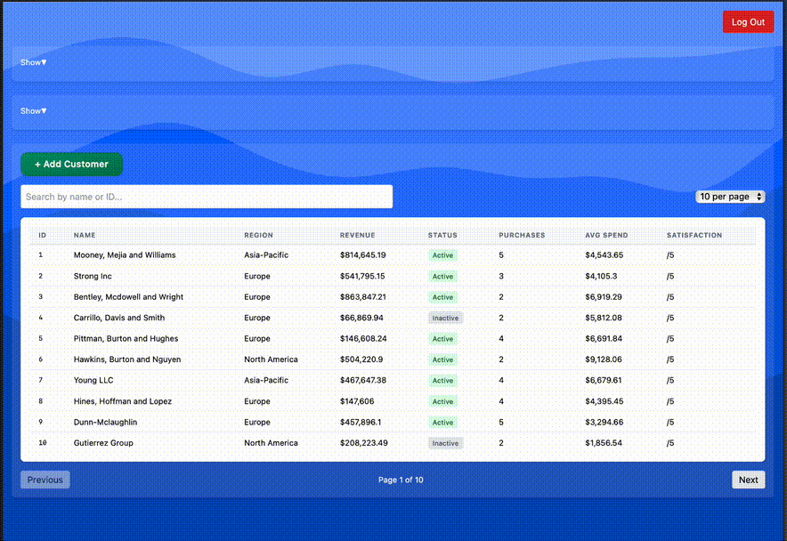
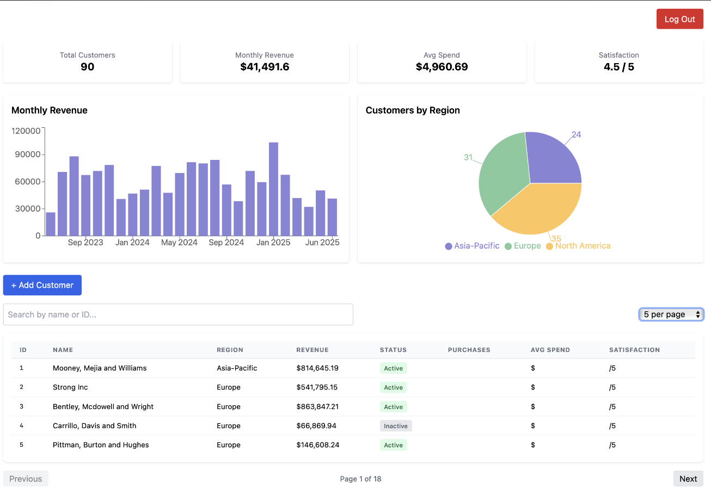
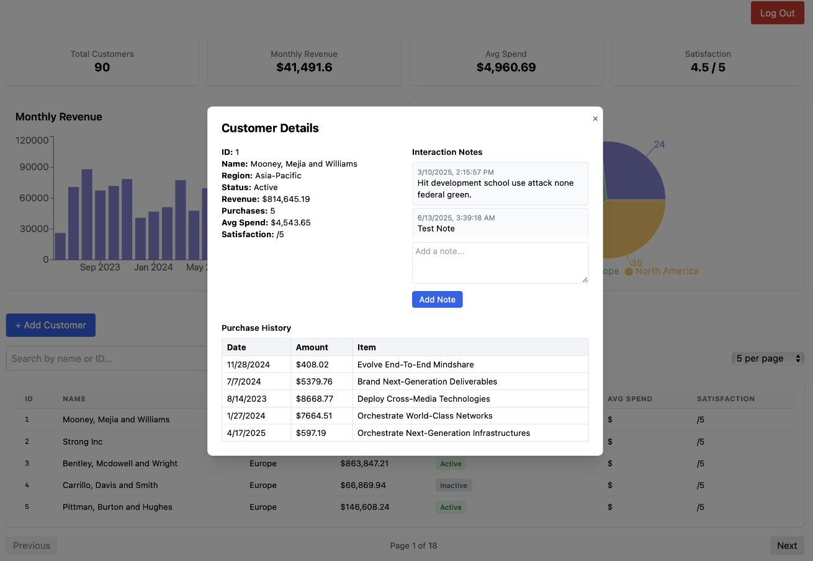

# Client Insights Dashboard

A full-stack customer analytics dashboard built with **React** and **Flask**. This app showcases modern frontend design, backend data handling, and real-time business insights — great for internal use or as a polished portfolio project.

---

## ✨ Features

- 🔐 Secure login with JWT (Flask-JWT-Extended)
- 📊 Real-time customer KPIs (total customers, revenue, avg spend)
- 📋 Searchable, paginated customer table with sorting
- 📝 Add customers via modal with backend validation
- 💬 Add interaction notes and view purchase history per customer
- ⚙️ Fully integrated Flask REST API
- 🌐 CORS-compatible across Safari, Firefox, and Chrome

---

## 📸 Screenshot



<h3>📸 Dashboard Snapshots</h3>

<p float="left">
  
  
</p>

## 🧱 Tech Stack

| Frontend               | Backend              | Utilities / Infra       |
|------------------------|----------------------|--------------------------|
| React + Tailwind CSS   | Flask (Python)       | Git + GitHub             |
| React Router DOM       | Flask-JWT-Extended   | Faker for test data      |
| Chart.js / Recharts    | Flask-SQLAlchemy     | SQLite                   |
| Context API for Auth   | Flask-CORS           | RESTful design patterns  |

---

## 🚀 Getting Started

### 🔧 Prerequisites

- Node.js + npm
- Python 3.x + `pip`
- [Optional] GitHub Desktop

---

### 🖥 Setup Instructions

```bash
# Clone the repo
git clone https://github.com/gilbe5jl/client-insights-dashboard.git
cd client-insights-dashboard

# Install frontend dependencies
cd web-app
npm install

# Start React dev server
npm start

# Go to backend
cd backend

# Set up virtual environment
python3 -m venv venv
source venv/bin/activate

# Install backend dependencies
pip install -r requirements.txt

# Seed the database
python seed.py

# Start Flask server
python app.py

Username: admin
Password: password123

client-insights-dashboard/
├── backend/
│   ├── app.py
│   ├── models.py
│   ├── seed.py
│   └── venv/
├── web-app/
│   ├── src/
│   │   ├── components/
│   │   ├── AuthContext.js
│   │   └── App.jsx
├── README.md